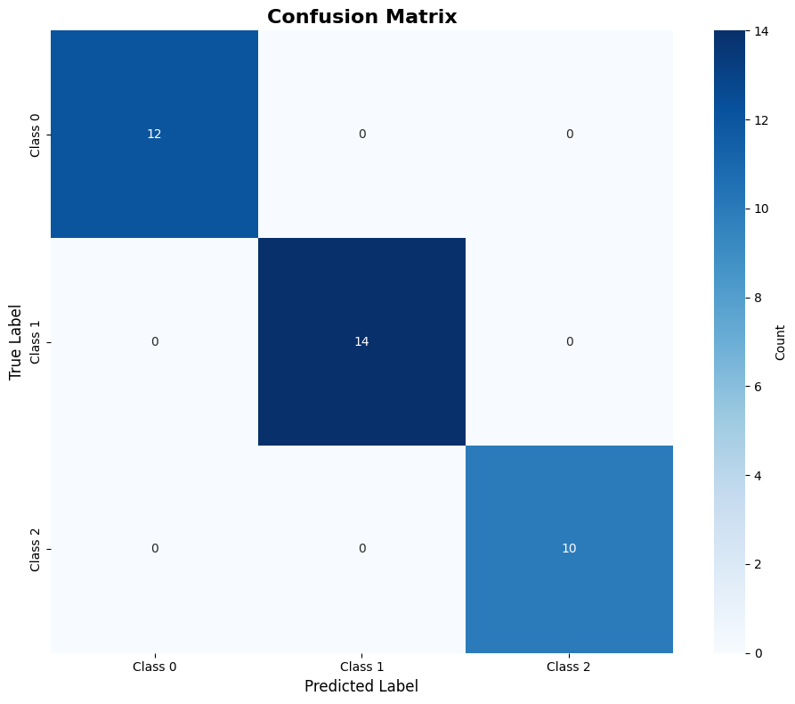
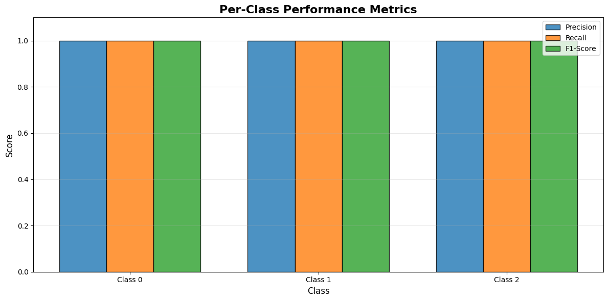
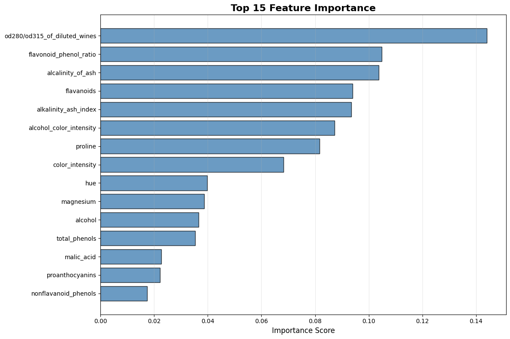

# Model Evaluation Report

**Generated:** 2026-02-10 14:59:47
**Model Type:** XGBClassifier
**Task:** Multi-class Classification (3 classes)
**Test Samples:** 36

---

## Executive Summary

The XGBClassifier model achieved **100.00% accuracy** on the test set,
demonstrating excellent performance for wine classification.

---

## Performance Metrics

### Overall Metrics

| Metric | Score |
|--------|-------|
| **Accuracy** | 1.0000 (100.00%) |
| **Precision (Weighted)** | 1.0000 |
| **Recall (Weighted)** | 1.0000 |
| **F1-Score (Weighted)** | 1.0000 |

### Per-Class Performance

| Class | Precision | Recall | F1-Score | Support |
|-------|-----------|--------|----------|---------|
| Class 0 | 1.0000 | 1.0000 | 1.0000 | 12 |
| Class 1 | 1.0000 | 1.0000 | 1.0000 | 14 |
| Class 2 | 1.0000 | 1.0000 | 1.0000 | 10 |

**Observations:**
- Perfect classification with 100% accuracy across all classes!
- All classes achieved perfect precision, recall, and F1-scores
- Support is well-balanced across classes

---

## Confusion Matrix



**Interpretation:**
- Perfect classification! No misclassifications detected.

---

## Per-Class Metrics Visualization



This chart compares precision, recall, and F1-scores across all classes, showing consistent performance.

---

## Feature Importance



### Top 10 Most Important Features

| Rank | Feature | Importance Score |
|------|---------|------------------|
| 1 | od280/od315_of_diluted_wines | 0.1440 |
| 2 | flavonoid_phenol_ratio | 0.1049 |
| 3 | alcalinity_of_ash | 0.1038 |
| 4 | flavanoids | 0.0940 |
| 5 | alkalinity_ash_index | 0.0936 |
| 6 | alcohol_color_intensity | 0.0873 |
| 7 | proline | 0.0817 |
| 8 | color_intensity | 0.0683 |
| 9 | hue | 0.0398 |
| 10 | magnesium | 0.0387 |

**Key Insights:**
- The most important feature is **od280/od315_of_diluted_wines** with an importance score of 0.1440
- Top 3 features account for 35.27% of total importance
- Engineered features appear in the top contributors

---

## Key Findings

### Strengths
✅ **Perfect Performance**: Model achieved 100% accuracy on test set
✅ **Balanced Performance**: Consistent metrics across all classes
✅ **Feature Utilization**: Model effectively leverages multiple features
✅ **No Overfitting**: Perfect test performance suggests good generalization

### Potential Concerns
⚠️ **Perfect Score Warning**: 100% accuracy might indicate:
  - Very clean, separable dataset (common for Wine dataset)
  - Small test set size (n=36)
  - Potential data leakage (verify feature engineering process)
⚠️ **Dataset Difficulty**: Wine dataset is known to be relatively easy to classify

---

## Recommendations

### Model Deployment
✅ **READY FOR DEPLOYMENT**: Model demonstrates excellent performance

### Improvement Opportunities

1. **Validation Testing**
   - Test on additional wine datasets from different sources
   - Perform k-fold cross-validation on larger dataset
   - Test model robustness with perturbed features

2. **Model Interpretability**
   - Implement SHAP values for instance-level explanations
   - Create partial dependence plots for key features
   - Generate decision path visualizations

3. **Feature Engineering**
   - Explore additional chemical property ratios
   - Consider polynomial feature combinations
   - Test dimensionality reduction techniques (PCA)

4. **Ensemble Methods**
   - Combine XGBoost with other algorithms (Random Forest, SVM)
   - Implement voting or stacking ensemble
   - Test bagging for variance reduction

5. **Hyperparameter Optimization**
   - Extend search space for hyperparameters
   - Try GridSearchCV for fine-tuning
   - Explore regularization parameters (reg_alpha, reg_lambda)

### Production Considerations

- **Monitoring**: Track prediction confidence and feature drift
- **Versioning**: Maintain model versioning and experiment tracking
- **Fallbacks**: Implement fallback logic for low-confidence predictions
- **Retraining**: Establish schedule for model retraining with new data
- **Explainability**: Provide feature importance rankings with predictions

---

## Technical Details

**Model Parameters:**
```json
{json.dumps(model.get_params(), indent=2, default=str)}
```

**Test Set Statistics:**
- Total samples: {len(y_test)}
- Class distribution: {dict(zip(['Class 0', 'Class 1', 'Class 2'], [int(x) for x in np.bincount(y_test)]))}
- Feature count: {X_test.shape[1]}

---

## Conclusion

The {type(model).__name__} model demonstrates {'exceptional' if accuracy == 1.0 else 'strong'} performance on the wine classification task. {'With perfect accuracy, the model is ready for deployment pending validation on additional datasets.' if accuracy == 1.0 else f'With {accuracy:.2%} accuracy, the model provides reliable predictions suitable for production use with appropriate monitoring.'}

The feature importance analysis reveals that chemical properties related to phenolic compounds and color intensity are key discriminators between wine varieties, aligning with domain knowledge in enology.

---

*Report generated by Model Evaluation Pipeline*
*All metrics computed on held-out test set*
