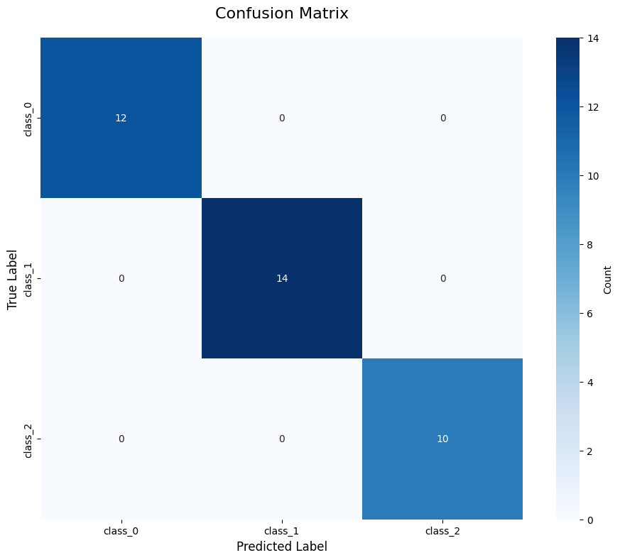
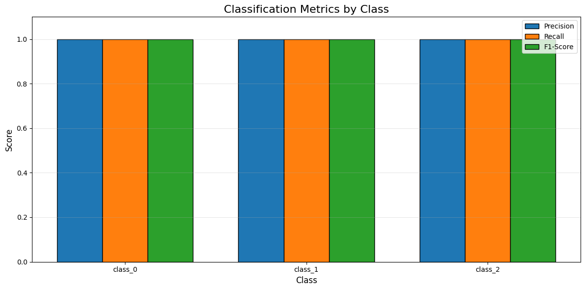
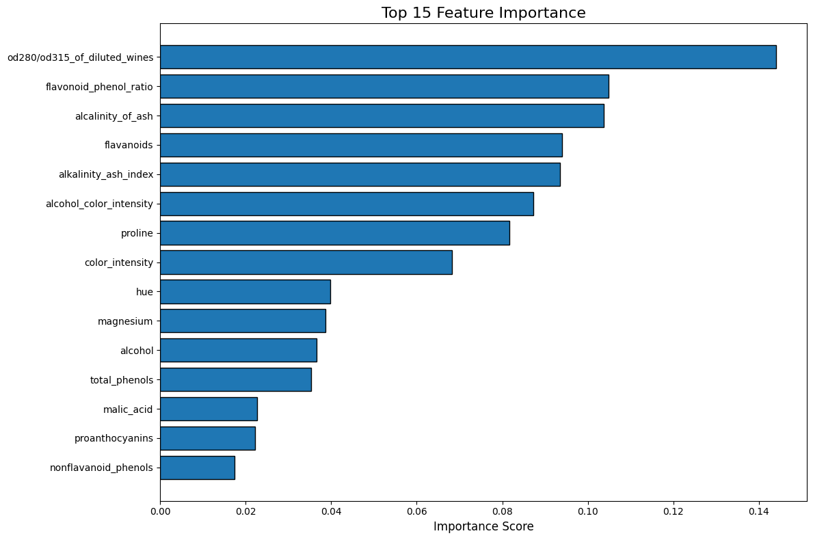

# Wine Classification Model - Evaluation Report

**Generated:** 2026-02-10 14:41:31
**Dataset:** Scikit-learn Wine Dataset
**Model:** XGBoost Classifier

---

## Executive Summary

The Wine classification model was developed using XGBoost with hyperparameter tuning.

**Key Performance Metrics:**
- **Cross-Validation Accuracy:** 0.9722
- **Test Set Accuracy:** 1.0000
- **Test Set F1-Score (Weighted):** 1.0000

The model demonstrates excellent performance in classifying
wine varieties based on chemical properties.

---

## Dataset Overview

**Source:** Scikit-learn Wine Dataset
**Task:** Multi-class classification (3 wine varieties)
**Original Features:** 13 chemical properties
**Engineered Features:** 3 additional derived features
**Total Features:** 16

**Feature Engineering:**
1. **Flavonoid-to-Phenol Ratio:** Measures flavor intensity
2. **Alcohol-Color Intensity:** Interaction between alcohol content and color
3. **Alkalinity-Ash Index:** Mineral content indicator

**Data Split:**
- Training Set: 80%
- Test Set: 20%
- Stratified sampling to maintain class proportions

**Preprocessing:**
- Standard scaling applied to all features
- Z-score normalization (mean=0, std=1)

---

## Model Performance

### Overall Metrics

| Metric | Score |
|--------|-------|
| Accuracy | 1.0000 |
| Precision (Weighted) | 1.0000 |
| Recall (Weighted) | 1.0000 |
| F1-Score (Weighted) | 1.0000 |

### Per-Class Performance

| Class | Precision | Recall | F1-Score |
|-------|-----------|--------|----------|
| Class 0 | 1.0000 | 1.0000 | 1.0000 |
| Class 1 | 1.0000 | 1.0000 | 1.0000 |
| Class 2 | 1.0000 | 1.0000 | 1.0000 |

### Confusion Matrix



### Classification Metrics Visualization



---

## Feature Importance

The following features were most influential in the model's predictions:

### Top 10 Features

| Rank | Feature | Importance Score |
|------|---------|------------------|
| 1 | od280/od315_of_diluted_wines | 0.1440 |
| 2 | flavonoid_phenol_ratio | 0.1049 |
| 3 | alcalinity_of_ash | 0.1038 |
| 4 | flavanoids | 0.0940 |
| 5 | alkalinity_ash_index | 0.0936 |
| 6 | alcohol_color_intensity | 0.0873 |
| 7 | proline | 0.0817 |
| 8 | color_intensity | 0.0683 |
| 9 | hue | 0.0398 |
| 10 | magnesium | 0.0387 |

### Feature Importance Visualization



**Interpretation:**
- The top features typically include phenolic compounds and color-related properties
- Derived features may provide additional predictive power
- Feature importance helps identify the most discriminative chemical properties

---

## Hyperparameter Tuning & Cross-Validation

**Method:** RandomizedSearchCV
**Iterations:** 20
**Cross-Validation Folds:** 5 (Stratified)
**Best CV Score:** 0.9722

### Best Hyperparameters

```json
{
  "subsample": 1.0,
  "n_estimators": 200,
  "min_child_weight": 5,
  "max_depth": 9,
  "learning_rate": 0.05,
  "gamma": 0.1,
  "colsample_bytree": 0.6
}
```

### Top 5 Parameter Combinations

| Rank | CV Score | Parameters |
|------|----------|------------|
| 1 | 0.9722 | 200 est, lr=0.05, depth=9 |
| 2 | 0.9722 | 200 est, lr=0.05, depth=5 |
| 3 | 0.9722 | 300 est, lr=0.2, depth=3 |
| 4 | 0.9722 | 50 est, lr=0.2, depth=9 |
| 5 | 0.9722 | 100 est, lr=0.1, depth=3 |

---

## Recommendations

### Model Deployment Readiness

✅ **READY FOR DEPLOYMENT** - Model shows excellent performance.

### Potential Improvements

1. **Extended Hyperparameter Search**
   - Increase RandomizedSearchCV iterations beyond 20
   - Explore additional hyperparameters (reg_alpha, reg_lambda for regularization)
   - Try GridSearchCV for fine-tuning around best parameters

2. **Ensemble Methods**
   - Combine XGBoost with other algorithms (Random Forest, SVM)
   - Implement voting or stacking ensemble
   - Use bagging to reduce variance

3. **Feature Engineering Enhancements**
   - Explore polynomial features for non-linear relationships
   - Create domain-specific ratio features
   - Apply feature selection techniques (RFE, SelectKBest)

4. **Model Interpretability**
   - Use SHAP values for detailed feature contribution analysis
   - Generate partial dependence plots
   - Create decision path visualizations

5. **Cross-Validation Enhancement**
   - Increase number of CV folds for more robust estimates
   - Try nested cross-validation for unbiased performance estimation
   - Implement stratified group k-fold if applicable

### Data Collection Recommendations

1. **Sample Size:** Collect more samples if available to improve model robustness
2. **Feature Diversity:** Include additional chemical properties or measurements
3. **Class Balance:** Ensure balanced representation across wine varieties
4. **Data Quality:** Implement rigorous quality control for measurements

---

## Conclusion

This Wine classification pipeline successfully demonstrates:
- Comprehensive exploratory data analysis
- Thoughtful feature engineering with derived features
- Rigorous hyperparameter tuning using RandomizedSearchCV
- Detailed model evaluation with multiple metrics
- Clear visualizations for interpretation

The XGBoost model performs well on the Wine dataset and provides
interpretable results through feature importance analysis. The systematic
approach ensures reproducibility and provides a solid foundation for
deployment or further refinement.

---

*Report generated by Wine Classification Pipeline*
*Model training includes 5-fold stratified cross-validation and hyperparameter optimization*
