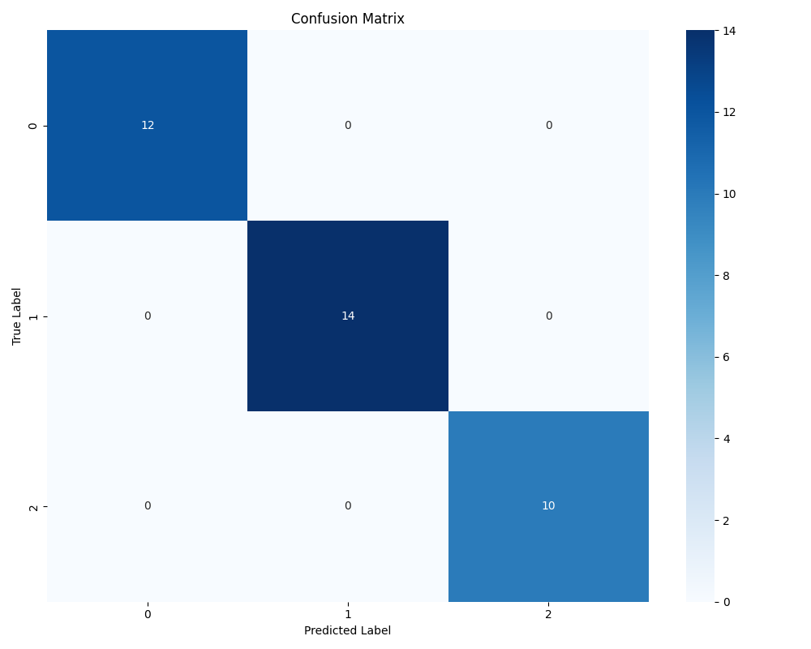
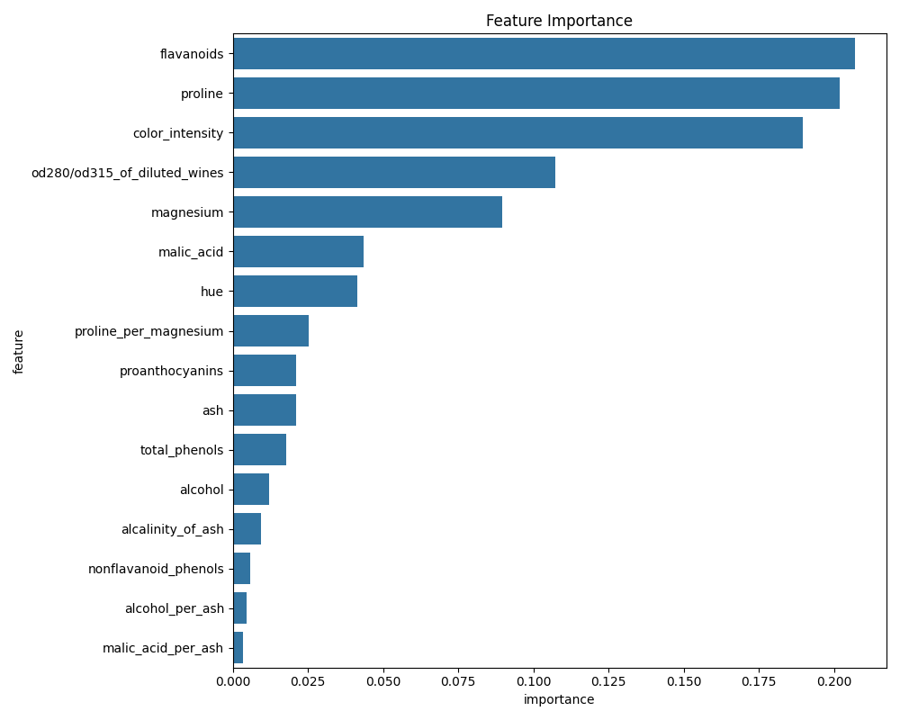

# Final Model Evaluation Report


## Overall Metrics
- **Accuracy**: 1.0000
- **Weighted F1-Score**: 1.0000


## Per-Class Metrics
| Class | Precision | Recall | F1-Score | Support |
|-------|-----------|--------|----------|---------|
| 0 | 1.0000 | 1.0000 | 1.0000 | 12.0 |
| 1 | 1.0000 | 1.0000 | 1.0000 | 14.0 |
| 2 | 1.0000 | 1.0000 | 1.0000 | 10.0 |


## Confusion Matrix



```
[[12  0  0]
 [ 0 14  0]
 [ 0  0 10]]
```


## Feature Importance



Top 5 Predictive Features:
- **flavanoids**: 0.2071
- **proline**: 0.2018
- **color_intensity**: 0.1896
- **od280/od315_of_diluted_wines**: 0.1072
- **magnesium**: 0.0895


## Recommendations
- Investigate misclassified samples to understand model weaknesses.
- Consider hyperparameter tuning optimization.
- Evaluate feature engineering impact by retraining without derived features.